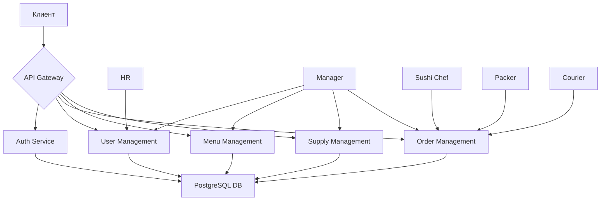

# Архитектурный документ: Бэкенд сервиса доставки суши

## 1. Обзор проекта

Сервис доставки суши представляет собой систему управления заказами, включающую в себя несколько ролей пользователей: сотрудников отдела кадров, менеджеров точки, сушистов, упаковщиков и курьеров. Архитектура основана на ASP.NET Core Web API с использованием Entity Framework Core и PostgreSQL.

## 2. Технический стек

- **Backend Framework**: ASP.NET Core Web API
- **ORM**: Entity Framework Core
- **Database**: PostgreSQL
- **Authentication**: JWT (JSON Web Tokens)
- **Architecture Pattern**: REST API

## 3. Схема базы данных

### 3.1. Основные сущности

#### 3.1.1. Пользователи и роли
- `users` - информация о пользователях (сотрудниках)
- `roles` - роли пользователей
- `user_roles` - связь пользователей и ролей (многие-ко-многим)

#### 3.1.2. Торговые точки
- `locations` - торговые точки
- `user_locations` - связь пользователей и точек (многие-ко-многим)

#### 3.1.3. Меню
- `categories` - категории товаров
- `products` - товары/блюда

#### 3.1.4. Заказы
- `orders` - заказы
- `order_items` - позиции в заказе
- `order_statuses` - статусы заказов
- `order_item_statuses` - статусы позиций заказа
- `order_status_history` - история изменения статусов заказов
- `order_item_status_history` - история изменения статусов позиций

#### 3.1.5. Складские поставки
- `inventory_supplies` - складские поставки
- `inventory_supply_items` - позиции в поставке

#### 3.1.6. Финансовые данные
- `courier_earnings` - заработок курьеров

### 3.2. Структура таблиц

#### Таблица `users`
```sql
id UUID PRIMARY KEY DEFAULT gen_random_uuid(),
username VARCHAR(50) UNIQUE NOT NULL,
email VARCHAR(100) UNIQUE NOT NULL,
password_hash VARCHAR(255) NOT NULL,
first_name VARCHAR(50) NOT NULL,
last_name VARCHAR(50) NOT NULL,
phone VARCHAR(20),
created_at TIMESTAMP WITH TIME ZONE DEFAULT CURRENT_TIMESTAMP,
updated_at TIMESTAMP WITH TIME ZONE DEFAULT CURRENT_TIMESTAMP,
is_active BOOLEAN DEFAULT TRUE
```

#### Таблица `roles`
```sql
id UUID PRIMARY KEY DEFAULT gen_random_uuid(),
name VARCHAR(50) UNIQUE NOT NULL,
description TEXT,
created_at TIMESTAMP WITH TIME ZONE DEFAULT CURRENT_TIMESTAMP
```

#### Таблица `locations`
```sql
id UUID PRIMARY KEY DEFAULT gen_random_uuid(),
name VARCHAR(100) NOT NULL,
address TEXT NOT NULL,
phone VARCHAR(20),
latitude DECIMAL(10, 8),
longitude DECIMAL(11, 8),
created_at TIMESTAMP WITH TIME ZONE DEFAULT CURRENT_TIMESTAMP,
updated_at TIMESTAMP WITH TIME ZONE DEFAULT CURRENT_TIMESTAMP
```

#### Таблица `categories`
```sql
id UUID PRIMARY KEY DEFAULT gen_random_uuid(),
name VARCHAR(100) NOT NULL,
description TEXT,
location_id UUID NOT NULL REFERENCES locations(id) ON DELETE CASCADE,
is_active BOOLEAN DEFAULT TRUE,
sort_order INTEGER DEFAULT 0,
created_at TIMESTAMP WITH TIME ZONE DEFAULT CURRENT_TIMESTAMP,
updated_at TIMESTAMP WITH TIME ZONE DEFAULT CURRENT_TIMESTAMP
```

#### Таблица `products`
```sql
id UUID PRIMARY KEY DEFAULT gen_random_uuid(),
name VARCHAR(100) NOT NULL,
description TEXT,
price DECIMAL(10, 2) NOT NULL,
category_id UUID NOT NULL REFERENCES categories(id) ON DELETE CASCADE,
location_id UUID NOT NULL REFERENCES locations(id) ON DELETE CASCADE,
image_url TEXT,
preparation_time INTEGER, -- Время приготовления в минутах
is_available BOOLEAN DEFAULT TRUE,
is_on_stop_list BOOLEAN DEFAULT FALSE,
created_at TIMESTAMP WITH TIME ZONE DEFAULT CURRENT_TIMESTAMP,
updated_at TIMESTAMP WITH TIME ZONE DEFAULT CURRENT_TIMESTAMP
```

#### Таблица `orders`
```sql
id UUID PRIMARY KEY DEFAULT gen_random_uuid(),
order_number VARCHAR(20) UNIQUE NOT NULL,
customer_name VARCHAR(100) NOT NULL,
customer_phone VARCHAR(20) NOT NULL,
customer_address TEXT NOT NULL,
location_id UUID NOT NULL REFERENCES locations(id) ON DELETE RESTRICT,
status_id UUID NOT NULL REFERENCES order_statuses(id) ON DELETE RESTRICT,
courier_id UUID REFERENCES users(id) ON DELETE SET NULL, -- Будет назначен позже
assembler_id UUID REFERENCES users(id) ON DELETE SET NULL, -- Упаковщик
total_amount DECIMAL(10, 2) NOT NULL,
delivery_fee DECIMAL(10, 2) DEFAULT 0,
comment TEXT,
created_at TIMESTAMP WITH TIME ZONE DEFAULT CURRENT_TIMESTAMP,
updated_at TIMESTAMP WITH TIME ZONE DEFAULT CURRENT_TIMESTAMP,
delivery_time TIMESTAMP WITH TIME ZONE,
completed_at TIMESTAMP WITH TIME ZONE
```

#### Таблица `order_items`
```sql
id UUID PRIMARY KEY DEFAULT gen_random_uuid(),
order_id UUID NOT NULL REFERENCES orders(id) ON DELETE CASCADE,
product_id UUID NOT NULL REFERENCES products(id) ON DELETE RESTRICT,
quantity INTEGER NOT NULL DEFAULT 1,
unit_price DECIMAL(10, 2) NOT NULL,
total_price DECIMAL(10, 2) NOT NULL,
status_id UUID NOT NULL REFERENCES order_item_statuses(id) ON DELETE RESTRICT,
prepared_by UUID REFERENCES users(id) ON DELETE SET NULL, -- Сушист
prepared_at TIMESTAMP WITH TIME ZONE,
assembled_by UUID REFERENCES users(id) ON DELETE SET NULL, -- Упаковщик
assembled_at TIMESTAMP WITH TIME ZONE
```

### 3.3. Статусы

#### Статусы заказов:
- pending (В обработке)
- confirmed (Подтвержден)
- preparing (Готовится)
- ready (Готов к сборке)
- assembled (Собран)
- picked_up (Забран курьером)
- delivered (Доставлен)
- cancelled (Отменен)

#### Статусы позиций заказа:
- pending (В ожидании)
- preparing (Готовится)
- prepared (Приготовлена)
- assembled (Упакована)
- delivered (Доставлена)
- cancelled (Отменена)

## 4. Архитектура REST API

### 4.1. Модуль пользователей `/api/users`

| HTTP метод | Путь | Описание | Права доступа |
|------------|------|----------|----------------|
| GET | `/api/users` | Получить список пользователей | HR |
| GET | `/api/users/{id}` | Получить информацию о пользователе | HR, Manager (own location), Courier (own info), Sushi Chef (own info), Packer (own info) |
| POST | `/api/users` | Создать нового пользователя | HR |
| PUT | `/api/users/{id}` | Обновить информацию о пользователе | HR, Manager (own info) |
| DELETE | `/api/users/{id}` | Удалить пользователя | HR |
| PUT | `/api/users/{id}/roles` | Назначить роли пользователю | HR |
| PUT | `/api/users/{id}/locations` | Назначить торговую точку пользователю | HR, Manager (own location) |

### 4.2. Модуль аутентификации `/api/auth`

| HTTP метод | Путь | Описание | Права доступа |
|------------|------|----------------|
| POST | `/api/auth/login` | Аутентификация пользователя | Public |
| POST | `/api/auth/logout` | Выход из системы | Authenticated |
| POST | `/api/auth/refresh` | Обновление токена | Authenticated |

### 4.3. Модуль ролей `/api/roles`

| HTTP метод | Путь | Описание | Права доступа |
|------------|------|----------|----------------|
| GET | `/api/roles` | Получить список всех ролей | HR |
| GET | `/api/roles/{id}` | Получить информацию о роли | HR |

### 4.4. Модуль торговых точек `/api/locations`

| HTTP метод | Путь | Описание | Права доступа |
|------------|------|----------|----------------|
| GET | `/api/locations` | Получить список всех торговых точек | HR, Manager (own location), Courier (own location), Sushi Chef (own location), Packer (own location) |
| GET | `/api/locations/{id}` | Получить информацию о торговой точке | HR, Manager (own location), Courier (own location), Sushi Chef (own location), Packer (own location) |
| POST | `/api/locations` | Создать новую торговую точку | HR |
| PUT | `/api/locations/{id}` | Обновить информацию о торговой точке | HR, Manager (own location) |
| DELETE | `/api/locations/{id}` | Удалить торговую точку | HR |

### 4.5. Модуль категорий `/api/categories`

| HTTP метод | Путь | Описание | Права доступа |
|------------|------|----------|----------------|
| GET | `/api/categories` | Получить список категорий (по точке) | Все |
| GET | `/api/categories/{id}` | Получить информацию о категории | Все |
| POST | `/api/categories` | Создать новую категорию | Manager |
| PUT | `/api/categories/{id}` | Обновить категорию | Manager |
| DELETE | `/api/categories/{id}` | Удалить категорию | Manager |

### 4.6. Модуль товаров `/api/products`

| HTTP метод | Путь | Описание | Права доступа |
|------------|------|----------|----------------|
| GET | `/api/products` | Получить список товаров (по точке и/или категории) | Все |
| GET | `/api/products/{id}` | Получить информацию о товаре | Все |
| POST | `/api/products` | Создать новый товар | Manager |
| PUT | `/api/products/{id}` | Обновить товар | Manager |
| DELETE | `/api/products/{id}` | Удалить товар | Manager |
| PUT | `/api/products/{id}/stop-list` | Добавить/удалить товар из стоп-листа | Manager |

### 4.7. Модуль заказов `/api/orders`

| HTTP метод | Путь | Описание | Права доступа |
|------------|------|----------|----------------|
| GET | `/api/orders` | Получить список заказов (с фильтрацией по статусу, точке и т.д.) | HR, Manager (own location), Courier (own orders), Sushi Chef (own location), Packer (own location) |
| GET | `/api/orders/{id}` | Получить информацию о заказе | HR, Manager (own location), Courier (own orders), Sushi Chef (own location), Packer (own location) |
| POST | `/api/orders` | Создать новый заказ | Public (через веб-интерфейс) |
| PUT | `/api/orders/{id}/status` | Обновить статус заказа | Manager, Courier (picked_up, delivered), Sushi Chef (when preparing), Packer (when assembling) |
| PUT | `/api/orders/{id}/assign-courier` | Назначить курьера | Manager, Courier (self-assign) |

### 4.8. Модуль позиций заказа `/api/order-items`

| HTTP метод | Путь | Описание | Права доступа |
|------------|------|----------|----------------|
| PUT | `/api/order-items/{id}/status` | Обновить статус позиции заказа | Sushi Chef (to prepared), Packer (to assembled) |

### 4.9. Модуль складских поставок `/api/supplies`

| HTTP метод | Путь | Описание | Права доступа |
|------------|------|----------|----------------|
| GET | `/api/supplies` | Получить список поставок | Manager |
| GET | `/api/supplies/{id}` | Получить информацию о поставке | Manager |
| POST | `/api/supplies` | Создать новую поставку | Manager |
| PUT | `/api/supplies/{id}` | Обновить поставку | Manager |
| DELETE | `/api/supplies/{id}` | Удалить поставку | Manager |

### 4.10. Модуль заработка курьеров `/api/earnings`

| HTTP метод | Путь | Описание | Права доступа |
|------------|------|----------|----------------|
| GET | `/api/earnings` | Получить список заработка (по курьеру и/или дате) | HR, Courier (own earnings) |
| GET | `/api/earnings/{id}` | Получить информацию о заработке | HR, Courier (own earnings) |

### 4.11. Модуль статусов `/api/statuses`

| HTTP метод | Путь | Описание | Права доступа |
|------------|------|----------|----------------|
| GET | `/api/statuses/orders` | Получить список статусов заказов | Все |
| GET | `/api/statuses/order-items` | Получить список статусов позиций заказа | Все |

## 5. DTO модели

### 5.1. Модель аутентификации

```csharp
// Запрос на аутентификацию
public class LoginRequestDto
{
    public string Username { get; set; }
    public string Password { get; set; }
}

// Ответ на аутентификацию
public class LoginResponseDto
{
    public string AccessToken { get; set; }
    public string RefreshToken { get; set; }
    public DateTime ExpiresIn { get; set; }
    public UserDto User { get; set; }
}

// Запрос на обновление токена
public class RefreshTokenRequestDto
{
    public string RefreshToken { get; set; }
}
```

### 5.2. Модель пользователя

```csharp
// Модель пользователя для ответа
public class UserDto
{
    public Guid Id { get; set; }
    public string Username { get; set; }
    public string Email { get; set; }
    public string FirstName { get; set; }
    public string LastName { get; set; }
    public string Phone { get; set; }
    public bool IsActive { get; set; }
    public List<RoleDto> Roles { get; set; }
    public List<LocationDto> Locations { get; set; }
    public DateTime CreatedAt { get; set; }
    public DateTime UpdatedAt { get; set; }
}

// Запрос на создание пользователя
public class CreateUserRequestDto
{
    public string Username { get; set; }
    public string Email { get; set; }
    public string Password { get; set; }
    public string FirstName { get; set; }
    public string LastName { get; set; }
    public string Phone { get; set; }
    public List<Guid> RoleIds { get; set; }
    public List<Guid> LocationIds { get; set; }
}

// Запрос на обновление пользователя
public class UpdateUserRequestDto
{
    public string Username { get; set; }
    public string Email { get; set; }
    public string FirstName { get; set; }
    public string LastName { get; set; }
    public string Phone { get; set; }
    public bool IsActive { get; set; }
}
```

### 5.3. Модель заказа

```csharp
// Модель заказа для ответа
public class OrderDto
{
    public Guid Id { get; set; }
    public string OrderNumber { get; set; }
    public string CustomerName { get; set; }
    public string CustomerPhone { get; set; }
    public string CustomerAddress { get; set; }
    public Guid LocationId { get; set; }
    public OrderStatusDto Status { get; set; }
    public UserDto Courier { get; set; }
    public UserDto Assembler { get; set; }
    public decimal TotalAmount { get; set; }
    public decimal DeliveryFee { get; set; }
    public string Comment { get; set; }
    public List<OrderItemDto> Items { get; set; }
    public DateTime CreatedAt { get; set; }
    public DateTime UpdatedAt { get; set; }
    public DateTime? DeliveryTime { get; set; }
    public DateTime? CompletedAt { get; set; }
}

// Запрос на создание заказа
public class CreateOrderRequestDto
{
    public string CustomerName { get; set; }
    public string CustomerPhone { get; set; }
    public string CustomerAddress { get; set; }
    public Guid LocationId { get; set; }
    public decimal DeliveryFee { get; set; }
    public string Comment { get; set; }
    public List<CreateOrderItemRequestDto> Items { get; set; }
    public DateTime? DeliveryTime { get; set; }
}
```

### 5.4. Другие важные DTO

Для краткости перечислим основные категории DTO:
- RoleDto - информация о роли
- LocationDto - информация о торговой точке
- CategoryDto - информация о категории
- ProductDto - информация о товаре
- OrderItemDto - позиция в заказе
- OrderStatusDto и OrderItemStatusDto - статусы
- InventorySupplyDto - складская поставка
- CourierEarningDto - заработок курьера

## 6. Безопасность

### 6.1. Аутентификация
- Использование JWT токенов для аутентификации
- Токены содержат информацию о пользователе и его ролях
- Поддержка обновления токенов

### 6.2. Авторизация
- Ролевая модель доступа (RBAC)
- Проверка прав доступа на уровне контроллеров и методов
- Ограничение доступа к данным в зависимости от принадлежности к торговой точке

## 7. Дополнительные возможности

### 7.1. Аудит
- История изменения статусов заказов и позиций
- Отслеживание действий пользователей

### 7.2. Масштабируемость
- Четкое разделение на уровни (контроллеры, сервисы, репозитории)
- Использование шаблона Repository
- Поддержка нескольких торговых точек

## 8. Диаграмма архитектуры


